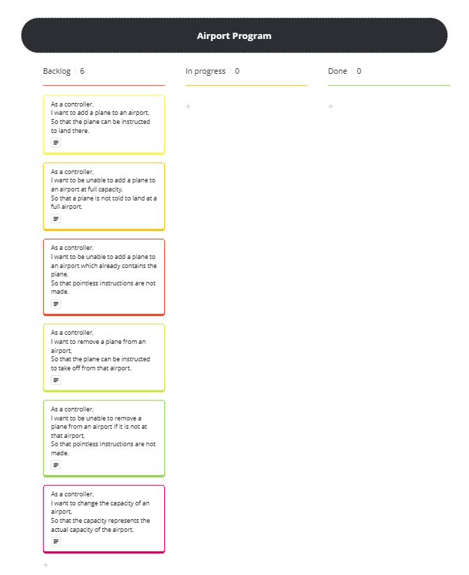

# Domain Models and Test Plan

## User Stories

### User Story 1
As a controller,
I want to add a plane to an airport,
So that the plane can be instructed to land there.

### User Story 2
As a controller,
I want to be unable to add a plane to an airport at full capacity,
So that a plane is not told to land at a full airport.

### User Story 3
As a controller,
I want to be unable to add a plane to an airport which already contains the plane,
So that pointless instructions are not made.

### User Story 4
As a controller,
I want to remove a plane from an airport,
So that the plane can be instructed to take off from that airport.

### User Story 5
As a controller,
I want to be unable to remove a plane from an airport if it is not at that airport,
So that pointless instructions are not made.

### User Story 6
As a controller,
I want to change the capacity of an airport,
So that the capacity represents the actual capacity of the airport.

### User Story 7
As a controller,
I want to be unable to add a plane to an airport who's weather is stormy,
So that landings are not conducted in dangerous weather.

### User Story 8
As a controller,
I want to be unable to remove a plane from an airport who's weather is stormy,
So that take-offs are not conducted in dangerous weather.

## Domain Models

### Domain Model 1
| Objects | Properties            | Messages            | Output |
| ------- | --------------------- | ------------------- | ------ |
| Plane   |                       |                     |        |
| Airport | planes @Array[@Plane] | assignPlane(@Plane) | @Void  |

### Domain Model 2
| Objects | Properties                                | Messages            | Output |
| ------- | ----------------------------------------- | ------------------- | ------ |
| Plane   |                                           |                     |        |
| Airport | planes @Array[@Plane] capacity @Number | assignPlane(@Plane) | @Void  |

### Domain Model 3
| Objects | Properties            | Messages            | Output |
| ------- | --------------------- | ------------------- | ------ |
| Plane   | id @Number            |                     |        |
| Airport | planes @Array[@Plane] | assignPlane(@Plane) | @Void  |

### Domain Model 4
| Objects | Properties            | Messages             | Output |
| ------- | --------------------- | -------------------- | ------ |
| Plane   | id @Number            |                      |        |
| Airport | planes @Array[@Plane] | removePlane(@Number) | @Void  |

### Domain Model 5
| Objects | Properties            | Messages             | Output |
| ------- | --------------------- | -------------------- | ------ |
| Plane   | id @Number            |                      |        |
| Airport | planes @Array[@Plane] | removePlane(@Number) | @Void  |

### Domain Model 6
| Objects | Properties       | Messages                  | Output |
| ------- | ---------------- | ------------------------- | ------ |
| Airport | capacity @Number | overrideCapacity(@Number) | @Void  |

### Domain Model 7
| Objects | Properties      | Messages            | Output |
| ------- | --------------- | ------------------- | ------ |
| Airport | weather @String | assignPlane(@Plane) | @Void  |

### Domain Model 8
| Objects | Properties      | Messages             | Output |
| ------- | --------------- | -------------------- | ------ |
| Airport | weather @String | removePlane(@Number) | @Void  |

## Test Cases

### User Story 1
- [x] Object passed to assignPlane() => Object added to planes
- [x] Object without id passed to assignPlane() => Object not added to planes
- [x] Non-object passed to assignPlane() => Planes array unchanged
- [x] Undefined passed to assignPlane() => Planes array unchanged
- [x] Object with id 0 passed to assignPlane() => Object added to planes
- [x] Object with id NaN passed to assignPlane() => Object not added to plane

### User Story 2
- [x] Object passed to assignPlane() when planes length more than capacity => Object not added to planes
- [x] Object passed to assignPlane() when planes length AT capacity => Object not added to planes

### User Story 3
- [x] Object passed to assignPlane() when object with same id already in planes => Object not added to planes
  
### User Story 4
- [x] Number passed to removePlanes() => Object with matching id removed from planes
- [x] Non-number passed to removePlanes() => Planes array unchanged
- [x] Undefined passed to removePlanes() => Planes array unchanged
- [x] NaN passed to removePlanes() => Planes array unchanged

### User Story 5
- [x] Number not matching id of any object in planes passed to removePlane() => Planes array unchanged

### User Story 6
- [x] Number passed to overrideCapacity() => capacity is changed
- [x] Non-number passed to overrideCapacity() => capacity is not changed
- [x] Undefined passed to overrideCapacity() => capacity is not changed
- [x] NaN passed to overrideCapacity() => capacity is not changed

### User Story 7
- [ ] Plane assigned to stormy airport -> Nothing added to airport array
- [ ] Plane assigned to "not stormy" airport -> Plane added to airport array

### User Story 8
- [ ] Plane removed from stormy airport -> airport array remains unchanged
- [ ] Plane removed from "not stormy" airport -> plane removed from airport array

## Kanban Board

## Generative AI Chat
